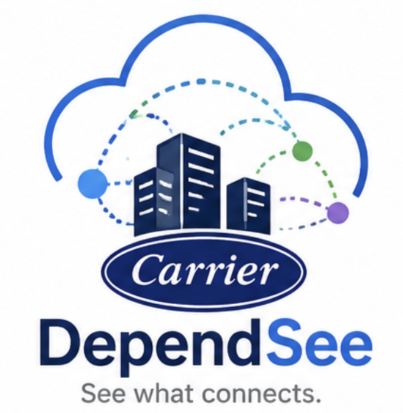

<div align="center">
  
  <h1>Carrier DependenSee</h1>
  <p><b>See what connects.</b> — Service &amp; connection mapping for on-prem → cloud migration.</p>

  
  
</div>

---

Carrier DependenSee maps a Windows machine so you can plan its move to AWS, Azure,
or GCP with confidence. A background service records **which services run** and
**every inbound/outbound connection over time**, attributing each to its owning
Windows service — the raw material for the firewall rules you'll need on the other
side. A cross-platform Avalonia GUI lets you explore that history, tag it, and
export migration-ready reports. A Linux port is on the roadmap and the codebase is
already structured for it.

## Features

- **Live dashboard** — registered services, listening endpoints, and active
  connections, refreshing on a timer. Toggle to hide standard Windows services and
  see only the third-party/application services that matter for a migration.
- **ETW event capture** — in addition to polling, the collector subscribes to
  kernel network events (when elevated) so connections that open and close
  between sweeps — DNS lookups, quick API calls, SQL logins — still make it into
  the history and the firewall report. Falls back to polling-only when ETW is
  unavailable.
- **Write-time flow aggregation** — every sweep is folded into a compact
  `connection_flows` table (one row per distinct dependency, with first/last
  seen and counts). Raw per-sweep rows are kept for a short drill-down window
  (default 7 days) while flows carry the full retention window (default 30
  days) at a tiny fraction of the size.
- **Service-name attribution** — each connection is resolved to its owning Windows
  service at collection time (e.g. `W3SVC` instead of a bare `svchost`), carried
  through every grid, export, and report.
- **History with rich filters** — search stored samples by process/service, remote
  address, port, protocol, direction, IP family, scope, and time window. Includes
  *does-not-contain* filters and toggles to hide ephemeral ports and same-subnet
  traffic.
- **Excel-style column filters** — a funnel on every History column opens a
  searchable, checkable list of the distinct values present, filtering instantly
  without re-querying.
- **Unique-flow collapsing** — fold thousands of repeated samples into distinct
  dependencies (with first/last seen and counts), ignoring ephemeral client ports.
- **Firewall PDF report** — a printable, migration-ready document that turns
  observed traffic into the inbound/outbound firewall rules the machine will need,
  with optional reverse-DNS and /24 source summarization.
- **Policy reconciliation** — load Palo Alto (Panorama) and Check Point CSV
  exports (all matching files in the folder are merged) and classify every
  observed flow as Covered, Gap, or Denied, protocol-aware, with the matching
  rule and its zones shown. Reverse reconciliation lists allow rules that cover
  the machine but were never exercised in the observation window — a tighten/
  decommission list for cutover. Unresolvable rule references (FQDN objects)
  are counted so Gaps caused by them are explainable.
- **Annotations** — tag any process, port, or host with a friendly name, owner, and
  criticality; these enrich the firewall PDF so it reads in business terms.
- **Dependency map** — a native node graph of the machine and its peers, colored by
  scope and direction, sized by traffic volume.
- **Fleet view & wave planner** — import databases from multiple machines and plan
  migration waves across them. Databases written by scheduled remote scans are
  picked up automatically. Each machine shows a migration-readiness score
  (observation window, sweep volume, attribution — with the reasons spelled
  out), new-dependency drift over the last 7 days, and its collection source.
- **Analysis built in** — deprecated/risky protocol findings (telnet, FTP,
  r-services, cleartext LDAP, NetBIOS, internet-exposed listeners) and
  freeze-drift detection land in every dossier; the fleet workbook rolls the
  estate up (inventory + readiness, full cross-dependency list, wave rollup
  with cross-wave counts).
- **Cloud rule generation** — every dossier includes AWS Security Group and
  Azure NSG starting points (Terraform + neutral JSON) derived from observed
  flows, plus a machine-readable dossier.json for pipelines. Headless export:
  `CarrierDependenSee.App.exe export-dossier --all --hours 168 --out D:\dossiers`.
- **Agentless remote scans that accumulate** — recurring (scheduled) WinRM/SSH
  scans take several snapshots per session (configurable sweeps + delay),
  harvest recently-closed flows from Linux kernel connection tracking
  (conntrack), append into per-host databases with the same retention split as
  the local collector, and record their sweep count so the firewall report can
  state its collection coverage honestly.
- **CSV / JSON export** — including a `source` (machine) column and resolved service
  name, so data from several machines can be combined and traced.
- **Server migration dossier** — one click exports everything known about a
  server as a single zip: an Excel workbook (Overview, Services, Listening
  ports, Inbound/Outbound flows, Cross-dependencies, Firewall reconciliation,
  Unused allow rules, Annotations), one CSV per section for pipelines, the
  firewall PDF, and a manifest with provenance (window, sweep count, tool
  version). Available for the active machine (History tab) and any fleet
  machine. Every export ends by revealing the saved file in Explorer
  (toggle in Settings).

Everything runs locally; the only optional network activity is reverse-DNS lookups
when generating a firewall PDF.

## Quick start

**Install from a release (recommended for end users)**

1. Grab the latest `Carrier-DependenSee-*.msi` from the
   [Releases](https://github.com/mathursunit/DependenSee/releases) page.
2. Double-click it and approve the UAC prompt. It installs to
   `C:\Program Files\Carrier DependenSee`, registers the collector service, and
   starts recording immediately.
3. Launch **Carrier DependenSee** from the Start Menu.

The .NET runtime is bundled — nothing else to install. See the
[User Guide](Carrier-DependenSee-User-Guide.html) for a full walkthrough.

## Architecture

The design separates a background **collector** (writer) from a **GUI reader**, and
isolates all OS-specific code behind interfaces so the Linux port is a drop-in.

```
ServiceMap.sln
├─ src/
│  ├─ ServiceMap.Core                  net8.0         Models, SQLite storage (WAL), export, retention, IP scope
│  ├─ ServiceMap.Platform.Abstractions net8.0         IServiceEnumerator, IConnectionSampler, IPlatformProvider
│  ├─ ServiceMap.Platform.Windows      net8.0-windows WMI + GetExtendedTcpTable/UdpTable P/Invoke
│  ├─ ServiceMap.Platform.Linux        net8.0         /proc/net + systemctl (port in progress)
│  ├─ ServiceMap.Engine                net8.0-windows Platform selection + collection orchestration (PID→service)
│  ├─ ServiceMap.Collector             net8.0-windows Windows Service (BackgroundService) writer
│  ├─ ServiceMap.Reporting             net8.0         Firewall-rule PDF (PDFsharp/MigraDoc)
│  └─ ServiceMap.App                   net8.0         Avalonia reader GUI (cross-platform)
├─ tools/
│  └─ ServiceMap.LinuxProbe            net8.0         Headless validation of the Linux path
├─ tests/
│  └─ ServiceMap.Tests                    net8.0         xunit tests (classifiers, parsers, matching, storage)
├─ installer/                                         WiX v5 MSI definition + build script (output → dist/installer)
└─ scripts/                                           Service install/uninstall, publish, push-to-github
```

> Internal namespaces remain `ServiceMap.*`; the shipped product identity is
> *Carrier DependenSee*.

### Why these choices

- **Avalonia (not WPF)** so the same GUI code runs on Windows now and Linux later.
- **WMI** for services because, unlike `ServiceController`, it returns the PID,
  path, start mode, and account in one query — and lets us map PID → owning service.
- **`GetExtendedTcpTable`/`GetExtendedUdpTable` P/Invoke** because the managed
  `IPGlobalProperties` APIs don't expose the owning process id — the point of
  attribution.
- **SQLite with WAL journaling** so the collector can write while the GUI reads the
  same file concurrently. Schema changes are additive migrations (currently v3).

## Data storage

- Default database: `C:\ProgramData\CarrierDependenSee\servicemap.db` (shared, machine-wide).
- Exports: `C:\ProgramData\CarrierDependenSee\exports`.
- Retention: raw connection samples older than `RawRetentionDays` (default 7) are
  pruned; aggregated flows are kept for `RetentionDays` (default 30).

Collector settings live in `src/ServiceMap.Collector/appsettings.json`:

| Setting | Default | Meaning |
|---|---|---|
| `SamplingIntervalSeconds` | 5 | Connection sampling cadence |
| `ServiceScanIntervalSeconds` | 60 | Service snapshot cadence |
| `RetentionDays` | 30 | Aggregated-flow history window |
| `RawRetentionDays` | 7 | Raw per-sweep sample window (clamped to `RetentionDays`) |
| `EventCaptureEnabled` | true | ETW capture of short-lived connections (needs elevation) |
| `RetentionSweepMinutes` | 60 | How often pruning runs |
| `AutoExportEnabled` | false | Periodic CSV export |

## Build from source

Requires the **.NET 8 SDK**.

```powershell
dotnet build ServiceMap.sln -c Release
```

### Self-contained publish (no .NET on the target)

```powershell
.\scripts\publish.ps1                 # win-x64 by default
.\scripts\publish.ps1 -Runtime win-arm64
```

Output lands in `dist\` as single-file executables with the runtime embedded.
Trimming is intentionally disabled because WMI and Avalonia use reflection.

### Build the MSI

```powershell
.\installer\build-installer.ps1 -Version 1.3.0.0
# produces dist\installer\Carrier-DependenSee-1.3.0.0-x64.msi
```

To Authenticode-sign the MSI (recommended for fleet deployment), pass the
thumbprint of a code-signing certificate from your certificate store:

```powershell
.\installer\build-installer.ps1 -Version 1.3.0.0 -SignThumbprint <SHA1-thumbprint>
```

The script installs the WiX v5 dotnet tool if needed, publishes both executables
self-contained, and compiles the `.msi`. WiX compiles MSIs on Windows only.

## Releasing (CI)

Two GitHub Actions workflows are included:

- **CI** (`.github/workflows/ci.yml`) — builds the whole solution on Windows and
  runs the unit tests (`tests/ServiceMap.Tests`) for every push and pull request
  to `main`.
- **Release** (`.github/workflows/release.yml`) — on a version tag, builds the MSI
  and attaches it to a GitHub Release.

To cut a release:

```powershell
git tag v1.3.0
git push origin v1.3.0
```

The workflow stamps the MSI version from the tag, uploads it as a build artifact,
and publishes a Release with auto-generated notes.

## Direction inference

A TCP connection is classified **inbound** when its local port is one the host
has recently been listening on, and **outbound** otherwise. The sampler keeps a
sliding window of listen ports across sweeps (15-minute TTL), so a listener
that restarts — or races the snapshot — doesn't flip its established
connections to outbound. Listening sockets are recorded as **Listen**. For
ETW-captured events no inference is needed: a Connect event is outbound and an
Accept event is inbound by definition. Polled UDP shows listening endpoints
only; ETW additionally captures outbound UDP sends (e.g. DNS). Remote addresses
are classified by **scope** (private / internet / loopback / link-local) to
isolate internet-facing traffic quickly.

## Linux roadmap

The Linux platform already parses `/proc/net/{tcp,tcp6,udp,udp6}` and enumerates
systemd units via `systemctl`; `tools/ServiceMap.LinuxProbe` runs it headless.
Remaining work to reach parity:

- Complete socket-inode → PID attribution (`/proc/[pid]/fd`) under root.
- Enrich systemd units with PID / exec path / enabled-state via `systemctl show`.
- Host the collector as a systemd daemon and wire `LinuxPlatformProvider` into
  `PlatformFactory`.
- Multi-target `ServiceMap.Engine` and `ServiceMap.App` to run the GUI on Linux.

## Notes & limitations

- Full attribution and complete service details require running the collector
  elevated (LocalSystem or an admin account); a few protected system sockets may
  still show as `unknown`.
- The firewall report reflects only traffic observed in the collection window — run
  the collector across a representative period (including nightly and month-end
  peaks) before finalizing rules.

---

<div align="center"><sub>Internal tool for Carrier Corporation's cloud migration · built by Sunit Mathur</sub></div>
